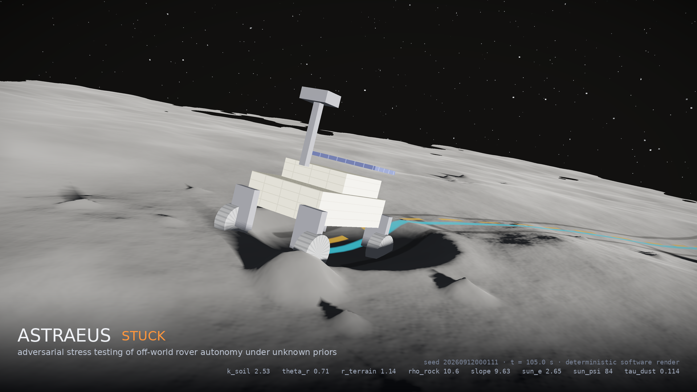
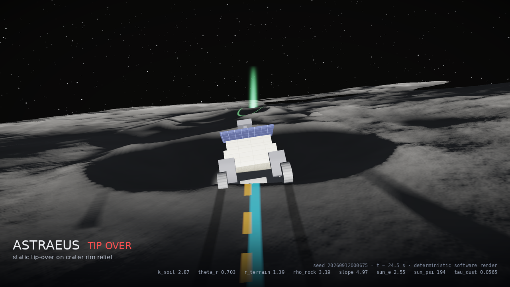
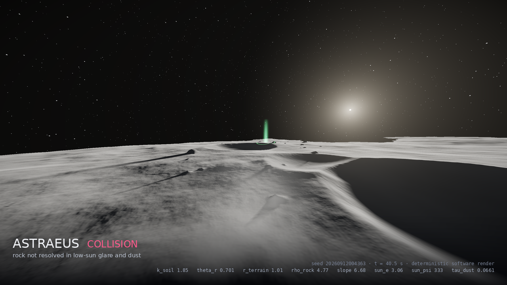
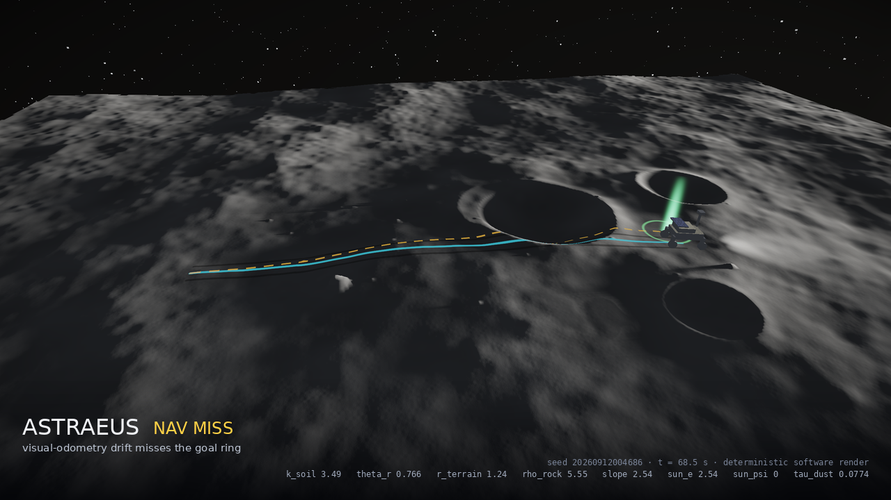
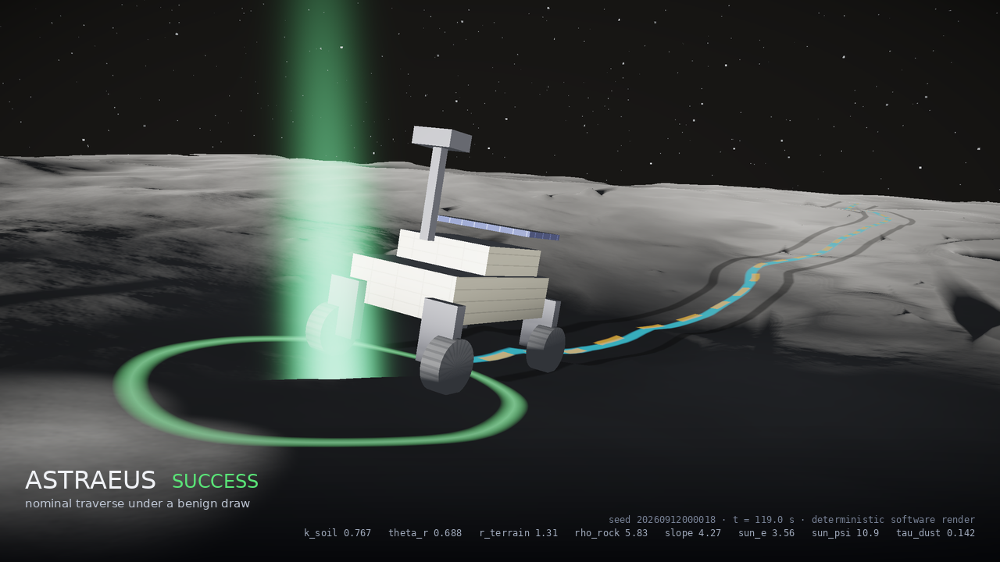
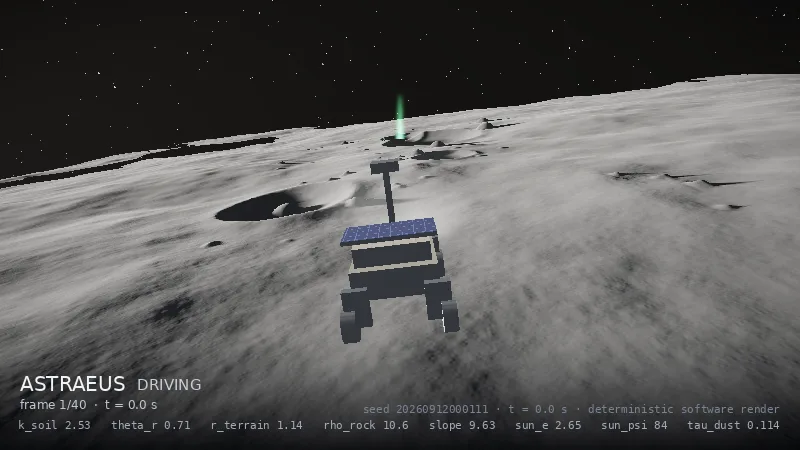

<div align="center">

# Astraeus

**Adversarial stress testing of off-world rover autonomy under unknown disturbance priors.**

[](https://github.com/vineigenphase/Non-Trivial---Astraeus/actions/workflows/ci.yml)
[](pyproject.toml)
[](LICENSE)
[-8A2BE2)](docs/ARCHITECTURE.md#determinism-contract)
[](CITATION.cff)
[](docs/RESEARCH.md)



<sub>Episode #111 of the validation campaign: soft sloped regolith, 2.65° sun, wheel sinkage exceeding traction.
Every pixel is a deterministic function of the eight numbers in the caption. Rendered by `astraeus/render.py`, no GPU.</sub>

</div>

---

A rover on the Moon will not meet the environment its engineers simulated. Soil will be softer or
firmer, the sun lower, rocks denser, the sky dustier after landing. Astraeus asks the question that
matters for that rover: **how likely is it to fail, and how much does the answer change when you are
honest about not knowing which environment it will face?**

It simulates thousands of traverses under an **eight-dimensional disturbance vector**, re-weights one
campaign under **six competing priors** about the destination with explicit reliability gates, searches
**adversarially** for the most plausible failures, and shows every episode in a **live, interactive world
model** and a **deterministic software renderer**. Everything runs on a laptop with NumPy. NVIDIA Isaac Sim,
OmniLRS/ROS 2 and Reactor world models are optional back-ends that share the same campaign format.

<div align="center">

| | |
|:--:|:--:|
| <br><sub>**tip-over** - static roll limit exceeded on crater-rim relief</sub> | <br><sub>**collision** - rock not resolved in low-sun glare and dust, rover camera</sub> |
| <br><sub>**nav_miss** - visual-odometry drift (amber) leaves the goal ring, overview</sub> | <br><sub>**success** - nominal traverse under a benign draw</sub> |



<sub>Chase-camera replay of the hero episode, 40 frames from departure to entrapment.
Cyan: true path. Amber: the rover's own visual-odometry estimate. Green ring and beacon: the goal.</sub>

</div>

---

## Contents

- [Why this exists](#why-this-exists)
- [What Astraeus does](#what-astraeus-does)
- [Quick start](#quick-start)
- [The eight disturbance dimensions](#the-eight-disturbance-dimensions)
- [Priors, proposal and the reliability gate](#priors-proposal-and-the-reliability-gate)
- [Results from the validation campaign](#results-from-the-validation-campaign)
- [Live interactive world model](#live-interactive-world-model)
- [Renderer](#renderer)
- [Command line](#command-line)
- [NVIDIA Isaac Sim, OmniLRS and ROS 2](#nvidia-isaac-sim-omnilrs-and-ros-2)
- [Reactor world model (optional)](#reactor-world-model-optional)
- [Architecture](#architecture)
- [Assumptions, known flaws and limitations](#assumptions-known-flaws-and-limitations)
- [Research](#research)
- [Development](#development)
- [Citing](#citing)

---

## Why this exists

Validation of autonomous systems usually samples disturbances from *one* assumed distribution and
reports *one* failure rate. For a destination nobody has driven, that single number hides the
decision that actually matters: **which prior you believed**. Astraeus makes the prior an explicit,
swappable input and treats the mismatch between what you simulated and what you believe as a
first-class result:

- one Monte-Carlo campaign is drawn from a **defensive mixture proposal `q`**;
- the *same* episodes are **re-weighted** under each candidate prior with `w = p_k(x) / q(x)`;
- every estimate carries an **effective sample size**, a **support-coverage** check and a
  **weighted-bootstrap confidence interval**;
- a prior whose mass the proposal never covered is reported as **not estimable**, not as a clean zero;
- a **cross-entropy search** finds the most severe failures that are still plausible under the prior you
  chose, and keeps them as replayable elites.

The result is a comparison across beliefs with the mechanisms behind each failure visible and
replayable, rather than a single number that looks precise and is not.

## What Astraeus does

| Stage | What happens | Where |
|---|---|---|
| **Simulate** | 430 kg VIPER-class four-wheel rover, 30 m goal-seeking traverse over procedural lunar terrain (relief, craters, rocks, regional slope). Bekker sinkage, slip-dependent traction, rut compaction, attitude and tip-over, rock collision, low-sun perception, dust-attenuated visibility, visual-odometry drift. Deterministic in `(x, seed)`. | `astraeus/rover.py`, `terrain.py`, `terramechanics.py`, `perception.py` |
| **Sample and re-weight** | Draw from `q`, compute importance weights under `P1..P6`, ESS, support coverage, bootstrap CIs, reliability gate. | `astraeus/priors.py`, `campaign.py` |
| **Analyse shift** | Dominant failure mode per prior, rank changes between priors, per-dimension sensitivity. | `astraeus/campaign.py` |
| **Search adversarially** | Cross-entropy method over `x` with a severity objective and a plausibility floor under the chosen prior; elites kept with `source = cem` so they never contaminate weighted estimates. | `astraeus/campaign.py` |
| **Render** | Ray-marched height field, true sun vector, shadows, dust extinction, five cameras, HUD or clean caption, contact sheets. | `astraeus/render.py` |
| **Show live** | WebGL world model of the exact terrain the physics used; eight sliders re-simulate in 0.1-0.6 s; campaign and CEM stream progress over WebSocket. | `astraeus/app.py`, `astraeus/static/` |
| **Bridge** | Isaac Sim standalone environment and OmniLRS/ROS 2 harness run the same `x`, log the same CSV, fold back in with `source = external`. | `isaac/` |

## Quick start

Python 3.10+. Core needs only NumPy and Pillow; the web UI adds FastAPI and Uvicorn.

```bash
git clone https://github.com/vineigenphase/Non-Trivial---Astraeus.git
cd Non-Trivial---Astraeus
python -m pip install -r requirements.txt

python -m astraeus selftest                        # 19 physical/statistical invariants, ~20 s
python -m astraeus run --n 2000 --out runs/c1.npz  # campaign under q, report for P1..P6
python -m astraeus cem runs/c1.npz --prior P2      # adversarial search, appended with provenance
python -m astraeus render runs/c1.npz --prior P5 --k 4 --sheet --quality 2
python -m astraeus serve --port 8000               # live world model at http://localhost:8000
```

`make test`, `make campaign`, `make renders`, `make serve` wrap the same commands.

## The eight disturbance dimensions

| # | Dimension | Physical channel | Support |
|--:|---|---|---|
| 1 | `k_soil`    | soil sinkage modulus, multiple of nominal → wheel sinkage, motion resistance | 0.5 - 5.0 (log-uniform under P1) |
| 2 | `theta_r`   | internal friction angle, rad (35°-50°) → shear strength, traction limit | 0.61 - 0.87 |
| 3 | `r_terrain` | relief amplitude, multiple of nominal → local slopes, attitude | 0.5 - 2.0 |
| 4 | `rho_rock`  | rocks per 100 m² → obstacle density, collision exposure | 0 - 12 |
| 5 | `slope_deg` | regional slope → gravity component along traverse | 0 - 15 |
| 6 | `sun_e`     | solar elevation → shadow length, camera contrast, detection | 0.5 - 6 (polar) |
| 7 | `sun_psi`   | solar azimuth → glare direction relative to heading | 0 - 360 |
| 8 | `tau_dust`  | dust optical depth, suspended + deposited → visibility, VO drift | 0 - 0.6 |

Each dimension reaches the rover through a named physical channel, so a sensitivity result is a
statement about a mechanism, not a regression coefficient. Definitions, derived quantities and the
rover constants: [docs/PARAMETERS.md](docs/PARAMETERS.md).

## Priors, proposal and the reliability gate

| Prior | Name | What it believes |
|---|---|---|
| `P1` | maximum ignorance    | uniform (log-uniform `k_soil`) over the whole support |
| `P2` | VIPER-spec south pole | firmer soil, moderate relief and rocks, sun skewed low (mode 1.5°), light dust |
| `P3` | simulator default    | tight kernel at the stock simulator settings, **sun at 45°** |
| `P4` | equatorial mare      | flat mare, sparse rocks, sun at its 4-6° low edge (the benign case) |
| `P5` | PSR rim, deep winter | steep flanks (mode 9°), loose regolith, dense ejecta, grazing sun 0.5-2.5° |
| `P6` | post-landing plume   | P2 terrain and lighting with heavy plume dust, `tau_dust` 0.25-0.6 |

Every episode is drawn from

```
q = 0.40·P1 + 0.15·(P2 + P4 + P5 + P6)
```

`P3` is deliberately **not** in the mixture and its 45° sun lies outside the simulated support. Astraeus
reports it as *not estimable* (ESS ≈ 1, 100 % of its mass outside support) instead of clipping the
parameter. That mismatch is a finding about Earth-convention simulator defaults, not a bug to hide.

**Reliability gate:** an estimate is flagged when `ESS < 30` or support coverage `< 0.5`. ESS is
`(Σw)² / Σw²`; CIs are weighted bootstrap.

## Results from the validation campaign

4000 proposal episodes + 2400 CEM rows, `gt_pose = False`, 13.8 s of simulation time. These are the
numbers behind the images above; the images were chosen for legibility, the numbers were not.

| Prior | P(fail) | 95 % CI | ESS / 4000 | Dominant mode |
|---:|---:|---:|---:|---|
| P1 | 0.550 | 0.530 - 0.573 | 1794 | stuck |
| P2 | 0.331 | 0.294 - 0.364 |  687 | stuck |
| P3 | n/a   | -             |    1 | *not estimable: 100 % outside support* |
| P4 | 0.084 | 0.064 - 0.108 |  583 | stuck |
| P5 | 0.665 | 0.629 - 0.697 |  675 | stuck |
| P6 | 0.379 | 0.347 - 0.417 |  667 | **nav_miss** |

Three things the single-prior approach would have missed:

1. **The answer spans 0.08 to 0.67** for the same rover, same software, depending only on which
   destination you believe in.
2. **The dominant failure mode changes.** Under P6 (plume dust) the rover stops failing by getting
   stuck and starts failing by *navigating to the wrong place*: dust degrades visual odometry faster
   than it degrades traction.
3. **P3 is not a number.** The stock simulator prior cannot be evaluated from a polar campaign, and
   the framework says so instead of printing `0.000`.

Test suite: 30 pytest cases + 19 selftest invariants, `ruff` clean, CI on Python 3.10 and 3.12.
Procedure, full tables and what was *not* validated: [docs/VALIDATION.md](docs/VALIDATION.md).

## Live interactive world model

```bash
python -m astraeus serve --port 8000
```

- **`/`** - the world model. A WebGL view of the *exact* height field the simulator used, rocks, craters,
  goal ring, true path and VO estimate. Eight live sliders for `x`; moving one re-simulates the episode
  in 0.1-0.6 s. Prior selector, elite-failure table, renderer frames from five cameras, contact sheets,
  campaign runner and CEM launcher with progress over WebSocket, named save/load.
- **`/internals`** - the engine room: importance weights, ESS per prior, support coverage, weighted
  marginals, per-dimension sensitivity, shift matrix and CEM traces.
- **REST + WebSocket API** - `/api/priors`, `/api/campaign`, `/api/campaign/run`, `/api/episodes`,
  `/api/episode/{i}`, `/api/episode/{i}/frame.png`, `/api/episode/{i}/sheet.png`, `/api/simulate`,
  `/api/whatif/frame.png`, `/api/sensitivity`, `/api/internals`, `/api/cem`, `/api/save`, `/api/load`,
  `/ws`. Payloads in [docs/ARCHITECTURE.md](docs/ARCHITECTURE.md).

Nothing is re-generated on the client: the browser shows the terrain the physics ran on.

## Renderer

`astraeus/render.py` is a NumPy software renderer with no GPU dependency. It ray-marches the height
field, shades with the true sun vector, casts terrain shadows, applies dust scattering, adds
multi-octave regolith texture and horizon-based ambient occlusion, darkens the wheel ruts along the
recorded path, draws the rover from its recorded attitude with MLI, solar-cell and tread detail,
overlays true/estimated paths and the goal ring, and tone-maps with a filmic curve. Cameras:
`chase`, `rover_cam`, `overview`, `orbit`, `cinematic`. Two overlays: the technical HUD (full
telemetry) and the clean lower-third caption used in this README.

```bash
python -m astraeus render runs/c1.npz --episode 111 --camera cinematic --quality 3   # HUD still
python scripts/make_showcase.py runs/c1.npz --hero-episode 111                       # README assets
python scripts/make_renders.py  runs/c1.npz --prior P1 --quality 3                   # HUD gallery + contact sheet
```

A contact sheet of one stuck episode with the technical HUD (`--sheet`): four cameras plus the full
disturbance vector and telemetry.


## Command line

```
python -m astraeus run      --n 4000 --out runs/c1.npz [--seed S] [--resume] [--gt-pose]
python -m astraeus cem      runs/c1.npz --prior P2 [--iters 6] [--batch 200]
python -m astraeus report   runs/c1.npz                 # text + JSON summary next to the run
python -m astraeus render   runs/c1.npz --episode 17 --camera orbit --quality 3
python -m astraeus render   runs/c1.npz --prior P5 --k 6 --sheet
python -m astraeus whatif   --x slope_deg=9 k_soil=0.8 --seed 3 --png out.png
python -m astraeus ingest   runs/c1.npz isaac/out/log.csv [--source csv|proposal|external]
python -m astraeus serve    --port 8000
python -m astraeus selftest
```

`ingest --source csv` (default) trusts each row's `source` column (`mc` / `cem` / `external` or `0/1/2`);
rows without one are treated as external. Only proposal rows enter importance-weighted estimates; CEM
and external rows are kept for replay, ranking and cross-simulator comparison.

## NVIDIA Isaac Sim, OmniLRS and ROS 2

`isaac/` contains the physics back-end scripts. They compile and their helper logic is unit-tested
without Isaac Sim installed. The Isaac/ROS runtime calls themselves are **unverified in this
repository** - see the status box in [docs/ISAAC_SIM.md](docs/ISAAC_SIM.md) before relying on them.

```bash
# Standalone Isaac Sim (run with Isaac's python.sh): builds terrain, rocks, craters, sun, dust and a
# rover from each x drawn from q, drives it, monitors the outcome, logs Astraeus-compatible CSV.
./python.sh isaac/standalone_env.py --episodes 200 --mode proposal --out isaac/out/log.csv

# OmniLRS via ROS 2: pushes sun / terrain / teleport commands, listens to pose, logs the same CSV.
python isaac/discover_topics.py            # verify topic names + types against a live sim first
python isaac/omnilrs_bridge.py --episodes 50 --mode proposal

# Load-time parameters (k_soil, theta_r) need one launch per stratum:
bash isaac/batch_run.sh isaac/configs/campaign.yaml

# Fold the results back in with provenance:
python -m astraeus ingest runs/c1.npz isaac/out/log.csv --source external
```

The same seed produces the same procedural terrain in the NumPy simulator and in
`isaac/export_terrain.py` (heightfield PNG/NPY + OBJ mesh), so an Isaac episode can be compared
against its local twin.

## Reactor world model (optional)

The default frame provider is the local renderer. `ASTRAEUS_PROVIDER=reactor` plus `REACTOR_API_KEY`
enables streaming frames from a Reactor ([reactor.inc](https://reactor.inc)) world model through
`reactor-sdk`, prompted from the eight parameters and rover state and optionally conditioned on the
local render. It **never replaces the local frame silently**: when a live frame is unavailable the UI
shows the local render tagged `live: false` with the reason. No credentials are needed for anything
else in the project. `python -m astraeus.providers --probe` prints the model's request schema.

## Architecture

```
astraeus/            simulator + campaign engine + renderer + web app (pure Python)
  priors.py          8 dims, bounds, P1..P6, proposal q, pdfs, weights, ESS
  terrain.py         procedural relief, craters, rocks, slope (deterministic in seed)
  terramechanics.py  Bekker sinkage, slip-traction, rut compaction/relaxation
  perception.py      visibility, detection, VO drift as functions of sun and dust
  rover.py           vectorised episode loop, controller, outcomes, traces
  campaign.py        MC chunks, weights, bootstrap CI, ESS, shift analysis, CEM, save/load, ingest
  render.py          software renderer, 5 cameras, HUD + caption overlays, contact sheets
  providers.py       LocalProvider / ReactorProvider (opt-in)
  app.py             FastAPI + WebSocket server
  static/            WebGL world model UI + internals page
  cli.py, selftest.py
isaac/               Isaac Sim standalone env, OmniLRS ROS 2 bridge, topic verifier, terrain export
  astraeus_isaac/    Isaac-free helper package (scene mapping, monitor, CSV log, export) - unit-tested
  configs/           lunar_scene.yaml, ros2_topics.yaml (verified: false), campaign.yaml
scripts/             make_showcase.py (README assets), make_renders.py (HUD renders + contact sheet)
tests/               pytest suite
legacy/              v1 OmniLRS harness (3-prior, 5-dim) kept for provenance
docs/                PARAMETERS, ARCHITECTURE, ISAAC_SIM, VALIDATION, RESEARCH + renders
```

Data flow, provenance rules, determinism contract and the HTTP/WebSocket schema:
[docs/ARCHITECTURE.md](docs/ARCHITECTURE.md).

## Assumptions, known flaws and limitations

Read this before quoting a number.

- **It is a reduced-order simulator.** Terramechanics is Bekker / Wong-Reece style with empirical slip
  coefficients, not DEM soil; the rover is a rigid body with kinematic four-wheel contact; the controller
  is a proportional heading controller with reactive rock repulsion. Absolute failure rates are
  properties of *this* rover in *this* simulator. The framework's value is the comparison across priors
  and the replayable failure mechanisms.
- **Priors P2 / P4 / P5 / P6 are engineering judgements**, documented in `astraeus/priors.py`, not
  calibrated mission data. Change them and re-run the report; the campaign does not need re-simulation.
- **P3 is not estimable by design.** Importance weights cannot recover mass the proposal never
  samples. Widening `q` to cover 45° sun would make P3 estimable but would spend samples on lighting
  no polar mission will see.
- **ESS is necessary, not sufficient.** A prior with ESS 600 / 4000 has real variance in its estimate;
  the bootstrap CI is the honest width, and it assumes the proposal covers the prior.
- **Perception is a model, not a pipeline.** Visibility, detection probability and VO drift are
  parametric functions of sun elevation, dust and contrast; no images are processed.
- **Isaac Sim rigid PhysX does not reproduce sinkage.** Without a terramechanics plugin, Isaac
  episodes show collision, tip-over and navigation failures but not Bekker entrapment; the bridge
  exposes a hook and documents the gap.
- **ROS 2 topic names are unverified** (`verified: false` in `isaac/configs/ros2_topics.yaml`) until
  `discover_topics.py` has been run against a live OmniLRS.
- **The Reactor provider was written against the reactor-sdk 1.5 surface** and probed for schema at
  runtime; no frames were generated in this repository's validation because no key was used.
- **Rendering is illustrative.** The renderer is physically motivated (true sun vector, shadowing, dust
  extinction) but not radiometrically calibrated; frames are diagnostic views, not sensor simulation.

## Research

Astraeus builds on adaptive stress testing (Lee et al.), black-box safety validation, importance-sampling
reliability estimation with defensive mixtures and the balance heuristic, cross-entropy rare-event
search, Bekker / Wong-Reece terramechanics, the Spirit "Troy" entrapment record, lunar regolith and
south-pole illumination studies, and the OmniLRS lunar simulator.

[docs/RESEARCH.md](docs/RESEARCH.md) has the bibliography and how each result is used, followed by
**Part B - the author's next-phase research programme**, clearly labelled as planned work with no
claimed results.

## Development

```bash
python -m pip install -r requirements-dev.txt
make check       # ruff + pytest + selftest (what CI runs)
make lint        # ruff check
make test        # pytest
make selftest    # python -m astraeus selftest
make serve       # uvicorn astraeus.app:app --port 8000
```

CI ([`.github/workflows/ci.yml`](.github/workflows/ci.yml)) runs ruff, `compileall`, pytest, the
selftest and a server smoke test on Python 3.10 and 3.12. Contribution rules, including the
determinism and provenance contracts, are in [CONTRIBUTING.md](CONTRIBUTING.md).

## Citing

```bibtex
@software{astraeus2026,
  title  = {Astraeus: adversarial stress testing of off-world rover autonomy under unknown disturbance priors},
  author = {Vinujan, S.},
  year   = {2026},
  url    = {https://github.com/vineigenphase/Non-Trivial---Astraeus},
  version = {2.0.0}
}
```

Machine-readable metadata: [CITATION.cff](CITATION.cff). License: [MIT](LICENSE).
