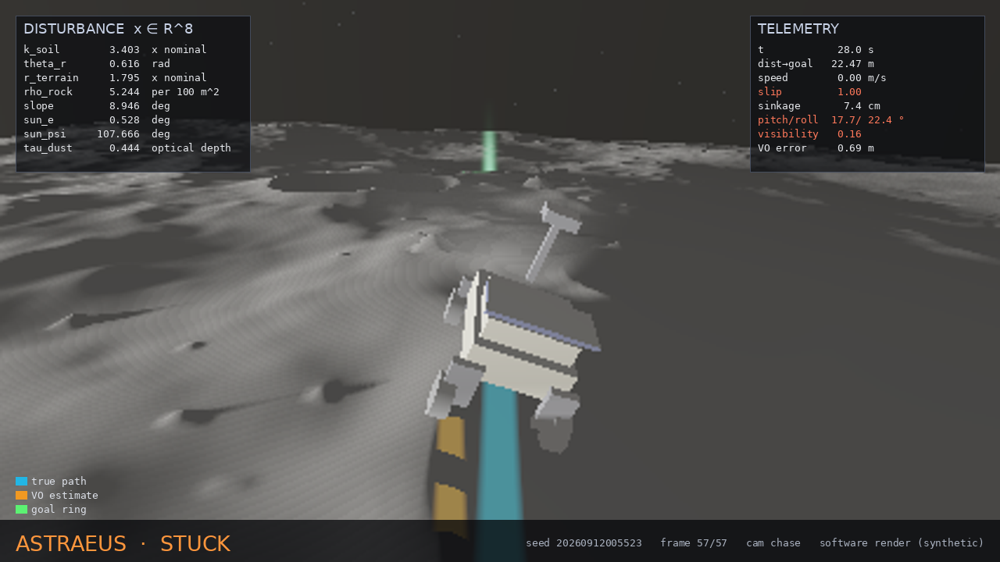
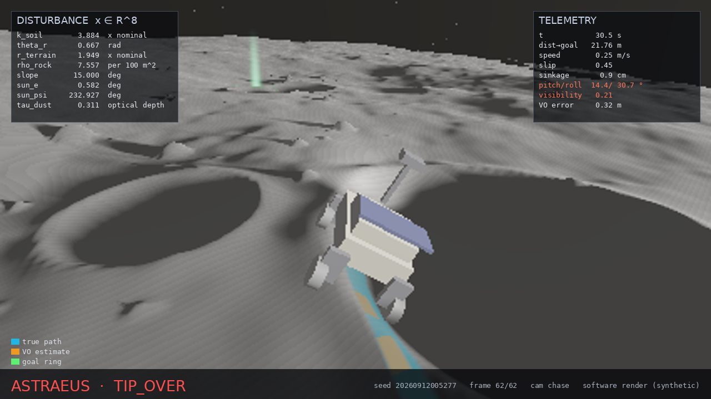
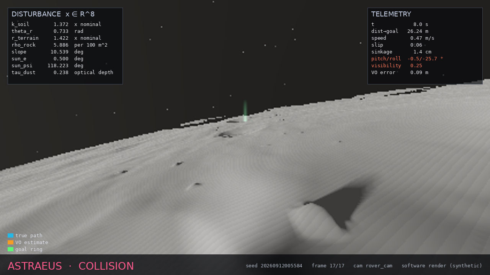
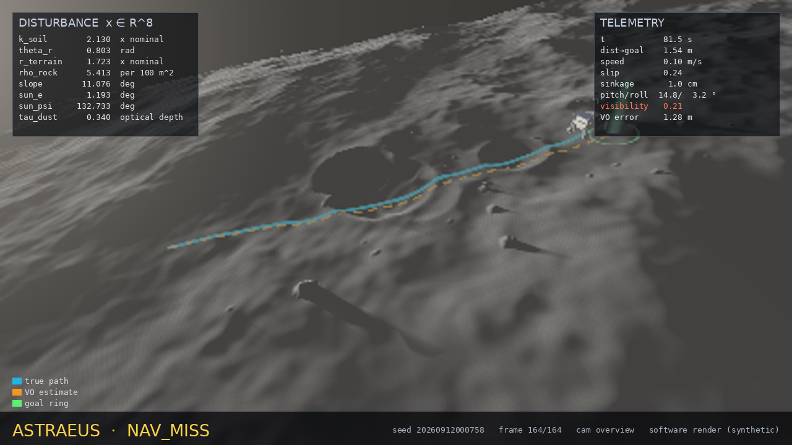
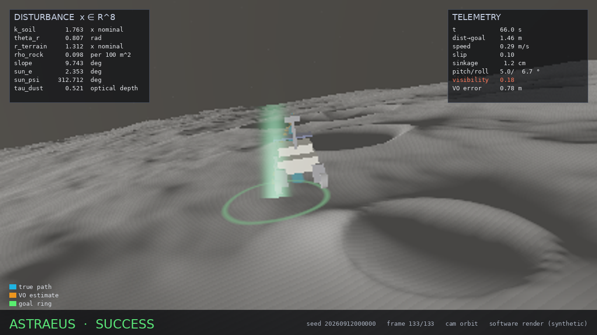
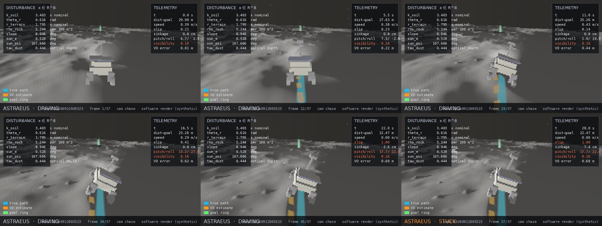

# Astraeus

**An open adversarial stress-testing (AST) framework for off-world autonomy under unknown disturbance priors.**

Astraeus asks one question of an autonomous rover: *how likely is it to fail, and how does that answer
change when you are not sure which environment it will face?* It simulates thousands of traverses
under an eight-dimensional disturbance vector, re-weights the same episodes under six competing
priors about the destination, searches adversarially for the most plausible failures, and shows every
episode in a live, interactive world model.



Everything in this repository runs on a laptop with NumPy: the simulator, the campaign engine, the
renderer and the web UI. NVIDIA Isaac Sim, OmniLRS/ROS 2 and Reactor world models are optional
back-ends that plug into the same campaign format.

---

## Contents

- [What Astraeus does](#what-astraeus-does)
- [Quick start](#quick-start)
- [The eight disturbance dimensions](#the-eight-disturbance-dimensions)
- [Candidate priors and the proposal](#candidate-priors-and-the-proposal)
- [Command line](#command-line)
- [Live interactive world model](#live-interactive-world-model)
- [High-quality renders](#high-quality-renders)
- [NVIDIA Isaac Sim, OmniLRS and ROS 2](#nvidia-isaac-sim-omnilrs-and-ros-2)
- [Reactor world model (optional)](#reactor-world-model-optional)
- [Validation evidence](#validation-evidence)
- [Assumptions, known flaws and limitations](#assumptions-known-flaws-and-limitations)
- [Documentation](#documentation)
- [Research](#research)
- [Repository layout](#repository-layout)
- [Development](#development)
- [License](#license)

---

## What Astraeus does

1. **Simulates** a 430 kg VIPER-class four-wheel rover driving a 30 m goal-seeking traverse over procedurally
   generated lunar terrain (relief, craters, rocks, regional slope) with wheel–soil mechanics
   (Bekker sinkage, slip-dependent traction, rut compaction), attitude and tip-over, rock collision,
   low-sun perception, dust-attenuated visibility and visual-odometry drift. Each episode is
   **deterministic in `(x, seed)`** and replays bit-for-bit.
2. **Samples** disturbances from a single defensive proposal `q` and **re-weights** the resulting
   episodes under six candidate priors `P1…P6` with importance weights `w = p_k(x)/q(x)`. Every prior
   gets a failure probability, a weighted-bootstrap confidence interval, an effective sample size and a
   support-coverage check. Estimates that fail the reliability gate are labelled, not hidden.
3. **Analyses distribution shift**: which failure mode dominates under which prior, whether the
   ranking of failure modes changes between priors, and how each dimension drives failure.
4. **Searches adversarially** with a cross-entropy method (CEM) for the highest-severity failures that
   are still plausible under a chosen prior, and keeps them as replayable elites.
5. **Renders** every episode: a NumPy software renderer produces HUD-annotated frames from four cameras
   and contact sheets, and a WebGL viewer shows the exact terrain the simulator used with the true and
   estimated trajectories.
6. **Bridges** to NVIDIA Isaac Sim (standalone) and OmniLRS/ROS 2 so the same disturbance vectors can be
   run in a physics engine, logged to CSV and folded back into the campaign with explicit provenance.

## Quick start

Requirements: Python 3.10+, NumPy, Pillow. FastAPI + Uvicorn for the web UI. PyYAML for the Isaac configs.

```bash
git clone https://github.com/vineigenphase/Non-Trivial---Astraeus.git
cd Non-Trivial---Astraeus
python -m pip install -r requirements.txt

python -m astraeus selftest                       # 19 invariant checks, ~20 s
python -m astraeus run --n 2000 --out runs/c1.npz # campaign under q, report for P1..P6
python -m astraeus cem runs/c1.npz --prior P2     # adversarial search, appended to the run
python -m astraeus render runs/c1.npz --prior P5 --k 4 --sheet --quality 2
python -m astraeus serve --port 8000              # live world model at http://localhost:8000
```

Or with `make`: `make test`, `make campaign`, `make renders`, `make serve`.

## The eight disturbance dimensions

| # | Dimension | Meaning | Support |
|---|-----------|---------|---------|
| 1 | `k_soil`    | soil sinkage modulus, multiple of nominal          | 0.5 – 5.0 (log-uniform under P1) |
| 2 | `theta_r`   | internal friction angle, rad (35° – 50°)           | 0.61 – 0.87 |
| 3 | `r_terrain` | terrain relief amplitude, multiple of nominal      | 0.5 – 2.0 |
| 4 | `rho_rock`  | rock density, rocks per 100 m²                     | 0 – 12 |
| 5 | `slope_deg` | regional slope, deg                                | 0 – 15 |
| 6 | `sun_e`     | solar elevation, deg                               | 0.5 – 6 (polar) |
| 7 | `sun_psi`   | solar azimuth, deg                                 | 0 – 360 |
| 8 | `tau_dust`  | dust optical depth (suspended + deposited)         | 0 – 0.6 |

Each dimension reaches the rover through a specific physical channel (sinkage, traction, geometry,
obstacles, gravity component, shadow length and camera contrast, glare direction, visibility).
Full definitions, channels and derived quantities: [docs/PARAMETERS.md](docs/PARAMETERS.md).

## Candidate priors and the proposal

| Prior | Name | What it believes |
|-------|------|------------------|
| `P1` | maximum ignorance   | uniform (log-uniform for `k_soil`) over the whole support |
| `P2` | VIPER-spec south pole | firmer soil, moderate relief and rocks, low-sun-skewed lighting (mode 1.5°), light dust |
| `P3` | simulator default   | tight kernel at the stock simulator settings, **sun at 45°** |
| `P4` | equatorial mare     | flat mare, sparse rocks, sun 4–6° at its low-elevation edge (the benign case) |
| `P5` | PSR rim, deep winter | steep flanks (mode 9°), loose regolith, dense ejecta rocks, grazing sun 0.5–2.5° |
| `P6` | post-landing plume  | P2 terrain and lighting with heavy plume dust, `tau_dust` 0.25–0.6 |

Every episode is drawn from `q = 0.40·P1 + 0.15·(P2 + P4 + P5 + P6)`. `P3` is intentionally **not** in
the mixture and its sun elevation lies outside the simulated support: the framework reports it as
*not estimable* (ESS ≈ 1, 100 % of its mass outside support) instead of clipping it. That mismatch is
a finding about Earth-convention simulator defaults, not a bug to hide.

Reliability gate: an estimate is flagged unreliable when `ESS < 30` or support coverage `< 0.5`.

## Command line

```
python -m astraeus run      --n 4000 --out runs/c1.npz [--seed S] [--resume] [--gt-pose]
python -m astraeus cem      runs/c1.npz --prior P2 [--iters 6] [--batch 200]
python -m astraeus report   runs/c1.npz                 # text + JSON summary next to the run
python -m astraeus render   runs/c1.npz --episode 17 --camera orbit --quality 3
python -m astraeus render   runs/c1.npz --prior P5 --k 6 --sheet
python -m astraeus whatif   --x slope_deg=9 k_soil=0.8 --seed 3 --png out.png
python -m astraeus ingest   runs/c1.npz isaac/out/log.csv [--source csv|proposal|external]
python -m astraeus serve    --port 8000
python -m astraeus selftest
```

`ingest --source csv` (default) trusts each row's `source` column (`mc`/`cem`/`external` or `0/1/2`);
rows without one are treated as external. Only proposal rows (`source=0`) enter importance-weighted
estimates; CEM and external rows are kept for replay, ranking and cross-simulator comparison.

## Live interactive world model

`python -m astraeus serve` starts a FastAPI server with:

- **`/`** — the world model. A WebGL view of the exact height field the simulator used, rocks, craters,
  goal ring, true path and VO estimate; eight live sliders for `x` (moving one re-simulates the episode
  in 0.1–0.6 s); prior selector; elite-failure table; renderer frames from four cameras; campaign runner
  and CEM launcher with progress over WebSocket.
- **`/internals`** — the engine room: importance weights, ESS per prior, support coverage, weighted
  marginals, dimension sensitivity, shift matrix and CEM traces.
- **REST + WebSocket API** — `/api/priors`, `/api/campaign`, `/api/campaign/run`, `/api/episodes`,
  `/api/episode/{i}`, `/api/episode/{i}/frame.png`, `/api/episode/{i}/sheet.png`, `/api/simulate`,
  `/api/sensitivity`, `/api/internals`, `/api/cem`, `/api/save`, `/api/load`, `/ws`.
  Route list and payloads: [docs/ARCHITECTURE.md](docs/ARCHITECTURE.md).

The browser shows the *same* terrain the physics ran on; nothing is re-generated on the client.

## High-quality renders

The software renderer in `astraeus/render.py` needs no GPU. It ray-marches the height field, shades
with the true sun vector, applies dust scattering and low-sun shadowing, draws the rover from its
recorded attitude, overlays the true/estimated paths and goal ring, and prints the full disturbance
vector and telemetry as a HUD. Cameras: `chase`, `rover_cam`, `overview`, `orbit`. `--quality 3`
supersamples for publication figures.

| | |
|---|---|
|  |  |
|  |  |

A contact sheet of one stuck episode (`--sheet`):



## NVIDIA Isaac Sim, OmniLRS and ROS 2

`isaac/` contains the physics back-end scripts. They compile and their helper logic is unit-tested
without Isaac Sim installed; the Isaac/ROS runtime calls themselves are **unverified in this
repository** (see the status box in [docs/ISAAC_SIM.md](docs/ISAAC_SIM.md)).

```bash
# Standalone Isaac Sim (Isaac's python.sh): builds terrain, rocks, craters, sun, dust and a rover
# from each x drawn from q, drives it, monitors the outcome, logs Astraeus-compatible CSV.
./python.sh isaac/standalone_env.py --episodes 200 --mode proposal --out isaac/out/log.csv

# OmniLRS via ROS 2: pushes sun / terrain / teleport commands, listens to pose, logs the same CSV.
python isaac/discover_topics.py            # verify topic names + types against a live sim
python isaac/omnilrs_bridge.py --episodes 50 --mode proposal

# Load-time parameters (k_soil, theta_r) need one launch per stratum:
bash isaac/batch_run.sh isaac/configs/campaign.yaml

# Fold the results back in with provenance:
python -m astraeus ingest runs/c1.npz isaac/out/log.csv --source external
```

The same seed produces the same procedural terrain in the NumPy simulator and in
`isaac/export_terrain.py` (heightfield PNG/NPY + OBJ mesh), so an Isaac episode can be compared
against its local twin.

## Reactor world model (optional)

The default frame provider is the local renderer. `ASTRAEUS_PROVIDER=reactor` plus `REACTOR_API_KEY`
enables streaming frames from a Reactor (reactor.inc) world model through `reactor-sdk`, prompted from
the eight parameters and rover state and optionally conditioned on the local render. It **never
replaces the local frame silently**: when a live frame is unavailable the UI shows the local render
tagged `live: false` with the reason. No credentials are needed for anything else in the project.
`python -m astraeus.providers --probe` prints the model's request schema.

## Validation evidence

Numbers from the 4000-episode proposal campaign (+2400 CEM rows) that produced the images above,
`gt_pose=False`, 13.8 s of simulation time:

| Prior | P(fail) | 95 % CI | ESS / 4000 | Top mode |
|------:|--------:|--------:|-----------:|----------|
| P1 | 0.550 | 0.530 – 0.573 | 1794 | stuck |
| P2 | 0.331 | 0.294 – 0.364 |  687 | stuck |
| P3 | — | — | 1 | *not estimable: 100 % outside support* |
| P4 | 0.084 | 0.064 – 0.108 |  583 | stuck |
| P5 | 0.665 | 0.629 – 0.697 |  675 | stuck |
| P6 | 0.379 | 0.347 – 0.417 |  667 | **nav_miss** |

The failure-mode ranking shifts across priors (P6's dust moves the dominant mode from mobility to
navigation). Test suite: 30 pytest cases (19 simulator/campaign/render invariants + 11 Isaac helper
tests), `ruff` clean. Details, procedure and what was *not* validated: [docs/VALIDATION.md](docs/VALIDATION.md).

## Assumptions, known flaws and limitations

Read this before quoting a number.

- **It is a reduced-order simulator.** Terramechanics is Bekker/Wong-Reece style with empirical slip
  coefficients, not DEM soil; the rover is a rigid body with kinematic four-wheel contact; the controller
  is a proportional heading controller with reactive rock repulsion. Absolute failure rates are properties of
  *this* rover-in-*this*-simulator; the framework's value is the comparison across priors and the
  replayable failure mechanisms.
- **Priors P2/P4/P5/P6 are engineering judgements**, documented in `astraeus/priors.py`, not
  calibrated mission data. Change them and re-run; the campaign does not need re-simulation.
- **P3 is not estimable by design.** Importance weights cannot recover mass the proposal never
  samples. Widening `q` to cover 45° sun would make P3 estimable but would also spend samples on
  lighting no polar mission will see.
- **ESS is a necessary, not sufficient, diagnostic.** A prior with ESS 600/4000 has real variance
  in its estimate; the bootstrap CI is the honest width, and it assumes the proposal covers the prior.
- **Perception is a model, not a pipeline.** Visibility, detection probability and VO drift are
  parametric functions of sun elevation, dust and contrast; no images are processed.
- **Isaac Sim rigid PhysX does not reproduce sinkage.** Without a terramechanics plugin, Isaac
  episodes show collision, tip-over and navigation failures but not Bekker entrapment; the bridge
  exposes a hook and documents the gap.
- **ROS 2 topic names are unverified** (`verified: false` in `isaac/configs/ros2_topics.yaml`) until
  `discover_topics.py` has been run against a live OmniLRS.
- **The Reactor provider was written against the reactor-sdk 1.5 surface** and probed for schema at
  runtime; no frames were generated in this repository's validation run because no key was used.
- **Rendering is illustrative.** The software renderer is physically motivated (true sun vector,
  shadowing, dust extinction) but not radiometrically calibrated; treat frames as diagnostic views.

## Documentation

| Document | Contents |
|----------|----------|
| [docs/PARAMETERS.md](docs/PARAMETERS.md)     | the eight dimensions, bounds, priors, proposal, weights, ESS, gates, outcomes, rover constants |
| [docs/ARCHITECTURE.md](docs/ARCHITECTURE.md) | package layout, data flow, provenance, determinism, HTTP/WebSocket API |
| [docs/ISAAC_SIM.md](docs/ISAAC_SIM.md)       | Isaac Sim / OmniLRS / ROS 2 integration, batch semantics, CSV schema, gaps |
| [docs/VALIDATION.md](docs/VALIDATION.md)     | what was run, the numbers, what was not validated |
| [docs/RESEARCH.md](docs/RESEARCH.md)         | AST and related literature; **next phase — the author's research programme** |

## Research

Astraeus builds on adaptive stress testing (Lee et al.), importance-sampling reliability estimation,
cross-entropy rare-event search, and terramechanics (Bekker, Wong & Reece). The bibliography, how each
result is used, and the clearly labelled next-phase research programme of the repository author are in
[docs/RESEARCH.md](docs/RESEARCH.md).

## Repository layout

```
astraeus/            simulator + campaign engine + renderer + web app (pure Python)
  priors.py          8 dims, bounds, P1..P6, proposal q, pdfs, weights, ESS
  terrain.py         procedural relief, craters, rocks, slope (deterministic in seed)
  terramechanics.py  Bekker sinkage, slip-traction, rut compaction/relaxation
  perception.py      visibility, detection, VO drift as functions of sun and dust
  rover.py           vectorised episode loop, controller, outcomes, traces
  campaign.py        MC chunks, weights, bootstrap CI, ESS, shift analysis, CEM, save/load, ingest
  render.py          software renderer, 4 cameras, HUD, contact sheets
  providers.py       LocalProvider / ReactorProvider (opt-in)
  app.py             FastAPI + WebSocket server
  static/            WebGL world model UI + internals page
  cli.py, selftest.py
isaac/               Isaac Sim standalone env, OmniLRS ROS 2 bridge, topic verifier, terrain export
  astraeus_isaac/    Isaac-free helper package (scene mapping, monitor, CSV log, export) — unit-tested
  configs/           lunar_scene.yaml, ros2_topics.yaml (verified: false), campaign.yaml
scripts/             make_renders.py (regenerates docs/img from a saved run)
tests/               pytest suite
legacy/              v1 OmniLRS harness (3-prior, 5-dim) kept for provenance
docs/                documentation and validation renders
```

## Development

```bash
make test        # pytest
make selftest    # python -m astraeus selftest
make lint        # ruff
make serve       # uvicorn astraeus.app:app --port 8000
```

Contributions that add calibrated priors, a terramechanics plugin for Isaac, verified OmniLRS topic
maps or a real perception pipeline are the most valuable. Keep estimates honest: never widen a prior
or clip a parameter to make a number look better.

## License

MIT — see [LICENSE](LICENSE).
